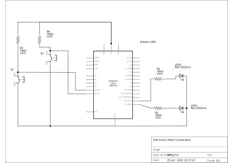
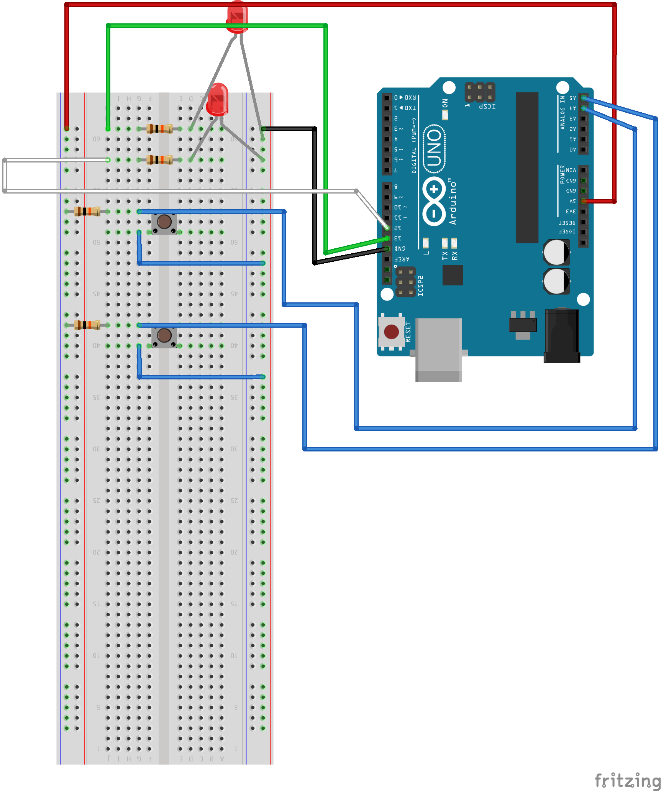

#Patch for GRBL project supporting the creation of punch machine for barrel organs.

The original Project is located at : [http://github.com/grbl/grbl](http://github.com/grbl/grbl)

##Introduction

This patch add a new M100 GCode command for punching. This punching command wait for the end of the move of the punch, and do a punch down and punch up action.

In this modification of grbl :
  - The spindle is disconnected, and the pins are reuse for punching
  - The D12 and D13 are now used for handling the actuators for the punch
  - The A4 and A5 pins for detecting the state of the punch (up or down)

All other pins are remained the same.

Only Arduino Uno CPU is tested yet.

##Arduino Uno connexions used by this patch

##Schematic View

##Prototype view

##Video demonstrating the new GCode Command

[https://www.youtube.com/watch?v=Sks70Pnujw8](https://www.youtube.com/watch?v=Sks70Pnujw8)

