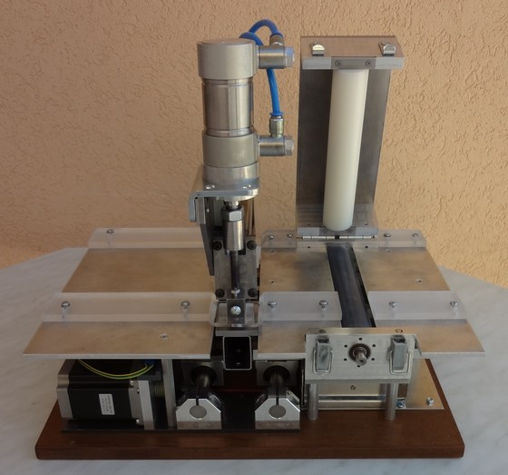
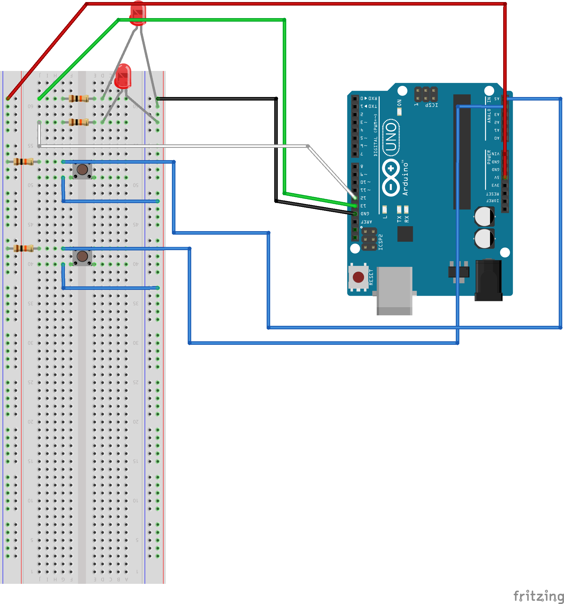

# GRBL_punch : GRBL enhanced project for punch machine

The original GRBL Project is located at : [http://github.com/grbl/grbl](http://github.com/grbl/grbl) this project is a fork specialized in punch machines as below. It has a X and Y axis plus a punch command for punching holes in the barrel organ book.

Punch machine designed and constructed by Jean Pierre Rosset.

## Introduction

This project add a new <b>M100 GCode</b> command designed for punching machines. This new punching M100 command handle the punch cycle. This command permit to wire punch actuators (bidirectionnal), electric motors  (unidirectional),  stepper motors (pulses), and associated sensors

## Grbl 0.9 introduced modifications

In the adjustment of grbl software :

- The spindle is disconnected, and the pins are reuse for punching
- The D12 and D13 are now used for handling the actuators for the punch
- The A4 and A5 pins for detecting the state of the punch (up or down)

All other pins are remained the same.

### Several command modes for the punch :

In the V2 (march 2018), 3 modes are possible in the command handling. The mode is a configuration settings introduced in the V2 version ($29 setting)

#### Mode : 0 -> 2 actuators command, 2 sensors (up / down)

The punch cycle introducted is the following

- activate the punch down actuator
- wait for the punch to be on bottom (wait the activation of the punchdown sensor)
- activate the punch up actuator
- wait for the punch to be up

at least you must have two sensors for the punch positions (up and down). the activation of the up actuator is optional as some punch actuator, once desactivated, move up the punch.

#### Mode : 1 -> 1 actuator command, 1 sensor (up)

This mode handle a simplified version of the command. The command is as follow, 

- activate the motor
- wait for the up sensor to be unactivated
- wait for the sensor to be activated
- unactivate the motor

#### Mode : 10 -> 1 stepper command, 1 sensor (up)

This mode handle a stepper, with clock pulse for the punch. the cycle is as follow :

- activate pulse for the stepper (clk)
- wait for the up sensor to be unactivated
- wait for the sensor to be activated
- stop stepper pulses

Only Arduino Uno CPU is supported yet in this version.

## Arduino Uno connexions

The D12 and D13 pins are used for controlling motors, these can have several meaning depending on the selected Mode.

The A4 and A5 pins are used for sensors.

# Default Mode (0) :

in the 0 mode ($29 setting), the punch is activated using 2 wires (up and down), 2 sensors detect the punch position.

## Prototype view for default mode

# Mode 1 : Simple Actuator and Sensor

This mode control a motor with only one wire, a sensor (up) permit the detection of the punch in the up position.

# Mode 10 : Stepper control

This mode control a stepper motor with only one sensor. The D12 digital pin is used to generate pulses that  make the stepper motor move, until the up sensor is detected.

## Video demonstrating the new M100 GCode Command

[https://www.youtube.com/watch?v=Sks70Pnujw8](https://www.youtube.com/watch?v=Sks70Pnujw8)

# How to Install the Grbl Punch software on Arduino Uno

The Easiest way to install the software is to use the XLoader software, you can download this software at this url [http://russemotto.com/xloader/](http://russemotto.com/xloader/)

Launch XLoader

Upload the grblPunch.hex file, 

**Warning : please download the hole project as a zip file, and take the grblPunch.hex file from it. Using internet Explorer to save the file as a text file can corrupt the file.**

That's all

You can then use the universal code sender to connect and configure the elements.

# Settings 

the first setting $29 define the punch control behaviour 

| \$29 setting value | Description                              |
| ------------------ | ---------------------------------------- |
| 0                  | Default behaviour (2 actuators, 2 sensors) |
| 1                  | one motor controlled by the activation (D12), one sensor detecting the up |
| 10                 | on stepper motor controlled by pulses on D12, one sensor detecting the up position |

Additional settings are introducted in this version of grbl, \$30, \$31, \$32,  \$33 for adjusting the behaviour of the punch cycle, depending on the actuator and sensors used.

	>>>> $30=0 (punch actuator down invert, bool)
	>>>> $31=0 (punch actuator up invert, bool)
	>>>> $32=1 (punch sensor down invert, bool)
	>>>> $33=1 (punch sensor up invert, bool)

the $32 and $33 settings permit to invert the detection of the punch position. 

<table>
<tr>
	<th>setting</th>
	<th>value</th>
	<th>description</th>
</tr>
<tr>
	<td>$30</td>
	<td>0</td>
	<td><b>The punch down</b> actuator is activated if the PIN is at <b>"5v"</b></td>
</tr>
<tr>
	<td>$30</td>
	<td>1</td>
	<td><b>The punch down</b> actuator is activated if the PIN is at <b>"0v"</b></td>
</tr>
<tr>
	<td>$31</td>
	<td>0</td>
	<td><b>The punch up</b> actuator is activated if the PIN is at <b>"5v"</b></td>
</tr>
<tr>
	<td>$31</td>
	<td>1</td>
	<td><b>The punch up</b> actuator is activated if the PIN is at <b>"0v"</b></td>
</tr>
<tr>
	<td>$32</td>
	<td>0</td>
	<td><b>The punch down</b> is detected down if the sensor is <b>"0v"</b></td>
</tr>
<tr>
	<td>$32</td>
	<td>1</td>
	<td><b>The punch down</b> is detected down if the sensor is <b>"5v"</b></td>
</tr>
<tr>
	<td>$33</td>
	<td>0</td>
	<td><b>The punch up</b> is detected up if the sensor is <b>"0v"</b></td>
</tr>
<tr>
	<td>$33</td>
	<td>1</td>
	<td><b>The punch up</b> is detected up if the sensor is <b>"5v"</b></td>
</tr>

</table>

you can view the associated parameters in launching the $$ command

	$$
	$0=10 (step pulse, usec)
	$1=25 (step idle delay, msec)
	$2=0 (step port invert mask:00000000)
	$3=0 (dir port invert mask:00000000)
	$4=0 (step enable invert, bool)
	$5=0 (limit pins invert, bool)
	$6=0 (probe pin invert, bool)
	$10=3 (status report mask:00000011)
	$11=0.010 (junction deviation, mm)
	$12=0.002 (arc tolerance, mm)
	$13=0 (report inches, bool)
	$20=0 (soft limits, bool)
	$21=0 (hard limits, bool)
	$22=0 (homing cycle, bool)
	$23=0 (homing dir invert mask:00000000)
	$24=25.000 (homing feed, mm/min)
	$25=500.000 (homing seek, mm/min)
	$26=250 (homing debounce, msec)
	$27=1.000 (homing pull-off, mm)
	>>>> $29=0
	>>>> $30=0 (punch actuator down invert, bool)
	>>>> $31=0 (punch actuator up invert, bool)
	>>>> $32=0 (punch sensor down invert, bool)
	>>>> $33=0 (punch sensor up invert, bool)
	$100=250.000 (x, step/mm)
	$101=250.000 (y, step/mm)
	$102=250.000 (z, step/mm)
	$110=500.000 (x max rate, mm/min)
	$111=500.000 (y max rate, mm/min)
	$112=500.000 (z max rate, mm/min)
	$120=10.000 (x accel, mm/sec^2)
	$121=10.000 (y accel, mm/sec^2)
	$122=10.000 (z accel, mm/sec^2)
	$130=200.000 (x max travel, mm)
	$131=200.000 (y max travel, mm)
	$132=200.000 (z max travel, mm)

you can change a setting value using :

	$33=1

## Improvements - RoadMap

<b>2018 - March</b>

- add support for Electric motor, CNC motor

<b>2016 - February</b>

- fix sensor detection, additional material has been setted up, we still need 2 sensors for the punch (eliminating the time in the equation)

<b>2015 - November</b>

- <strike>by settings, 
    - able to use a "pull up" logic on the hard limit
    - or use two 0-1 detector on both side of the X axis</strike>

<b>2015 - November</b>

- Validation of the master branch with a real machine

<b>Todo</b>

- Check at startup that the punch is up, before starting (part of the homing cycle checks)
